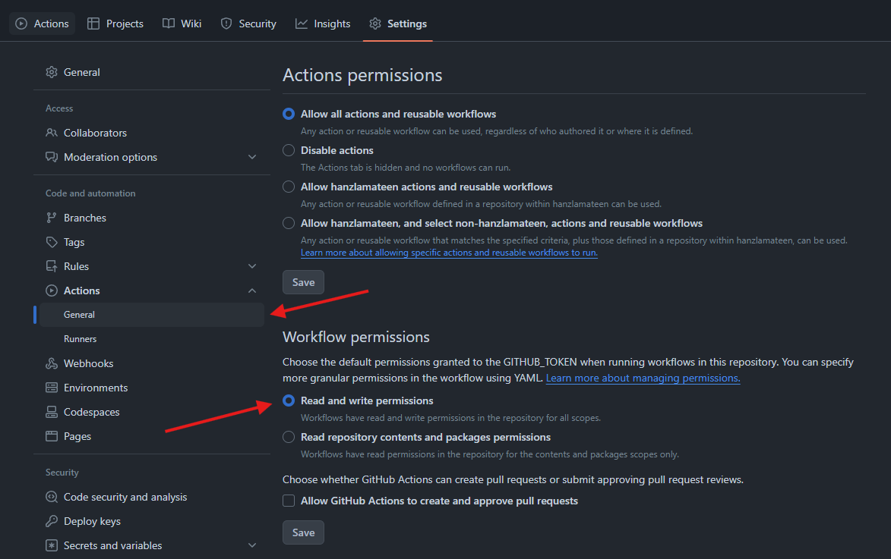
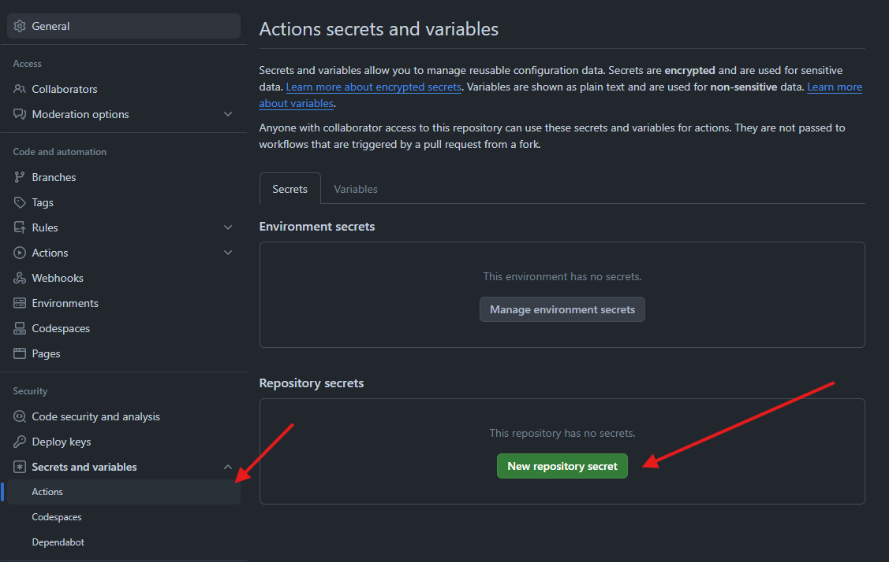
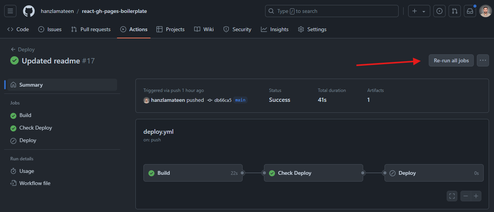
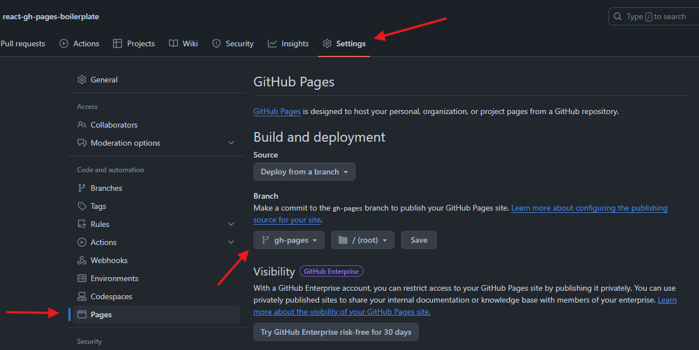

<br>

<p>
  React GitHub Pages Boilerplate uses <a href="https://facebook.github.io/react/">React</a>, <a href="https://pages.github.com/">GH-Pages</a>, <a href="https://vitejs.dev/">Vite</a>, <a href="https://tailwindcss.com/">Tailwind</a>, <a href="https://daisyui.com/">DaisyUI</a>, <a href="https://animate.style/">Animate.css</a>.
</p>

<br>

<div align="center">

[![Build Status][github-actions-status]][github-actions-url]
[![Github Tag][github-tag-image]][github-tag-url]

[](#backers)
[](#sponsors)
[![StackOverflow][stackoverflow-img]][stackoverflow-url]

</div>

## Why `react-gh-pages-boilerplate`

In addition to providing a boilerplate, this template also solves <a href="https://stackoverflow.com/questions/63462828/404-error-on-refresh-with-spa-react-router-app-in-github-pages" target="_blank">404 error</a> when refreshing a React app deployed to GitHub Pages. That too without using Hash Router.

Additionally, you can get rid of any libraries that are installed and replace them with preferred.

## Install

Clone the repo and install dependencies:

```bash
git clone --depth 1 --branch main https://github.com/hanzlamateen/react-gh-pages-boilerplate.git your-project-name
cd your-project-name
npm install
```

## Starting Development

Start the app in the `dev` environment:

```bash
npm run dev
```

## Packaging for Production

To create a production build in `dist` folder:

```bash
npm run build
```

## Test a Production Build

Start the dev server and test production build:

```bash
npm run preview
```

## Documentation

### 1. Setup Github Pages

#### 1.1. On your Repo Page

1. Go to **Settings** → **Actions** → **General**.
2. Scroll down to **Workflow permissions**.
3. Choose **Read and write permissions** and hit **Save**.



#### 1.2. On your Repo Page

1. Go to **Settings** → **Secrets and variables** → **Actions**.
2. Click **New Repository Secret**.
3. Add **Name** as `GH_PAGE_DEPLOY` and **Secret** as `true. Hit **Add Secret**.



#### 1.3. Run GitHub Deploy Actions

**Actions** → choose last deployment → **Re-run all jobs**. Wait until in finishes.



#### 1.4. Configure GitHub Pages

1. Go to **Settings** → **Pages**.
2. Under **Source**, choose "**Deploy from a branch**" and select the "**gh-pages**" branch.
3. Click **Save**.



Once the workflow finishes successfully, you'll see a new deployment on your GitHub Pages. Click the link to access your deployed React application.

### 2. Additional Resources

- [Tailwind CSS Directory](https://tailwindcss.com/docs/font-size)
- [Components Directory](https://daisyui.com/components/)
- [Animations Directory](https://animate.style/)
- [Icons Directory](https://react-icons.github.io/react-icons/)
- [Setup Github Page](https://www.vddeveloper.online/blog/vite-react-deploy-github)

## Back Us

Support us with a monthly donation and help us continue our activities.

<a href="https://opencollective.com/react-gh-pages-boilerplate#backer" target="_blank"></a>

## Sponsor Us

<a href="https://opencollective.com/react-gh-pages-boilerplate#sponsor" target="_blank"></a>

## Maintainers

- [Hanzla Mateen](https://github.com/hanzlamateen)

## License

MIT © [Hanzla Mateen](https://github.com/hanzlamateen)

[github-actions-status]: https://github.com/hanzlamateen/react-gh-pages-boilerplate/workflows/Deploy/badge.svg
[github-actions-url]: https://github.com/hanzlamateen/react-gh-pages-boilerplate/actions
[github-tag-image]: https://img.shields.io/github/tag/hanzlamateen/react-gh-pages-boilerplate.svg?label=version
[github-tag-url]: https://github.com/hanzlamateen/react-gh-pages-boilerplate/releases/latest
[stackoverflow-img]: https://img.shields.io/badge/stackoverflow-react_gh_pages_boilerplate-blue.svg
[stackoverflow-url]: https://stackoverflow.com/questions/tagged/react-gh-pages-boilerplate
